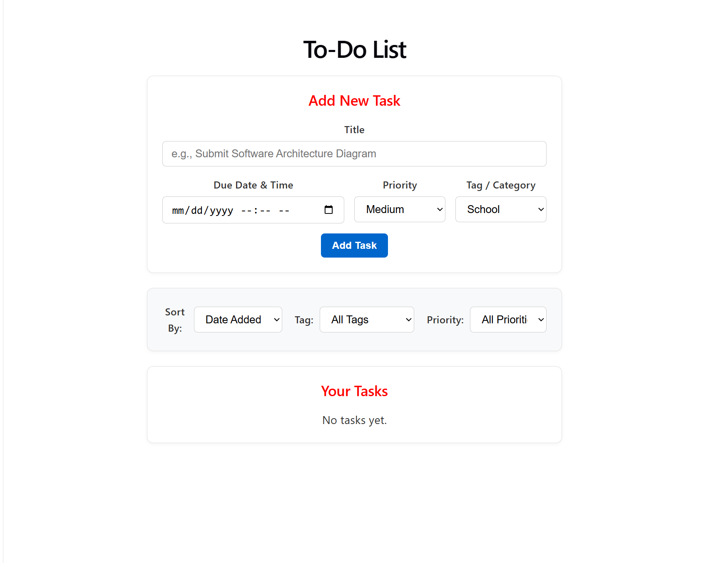
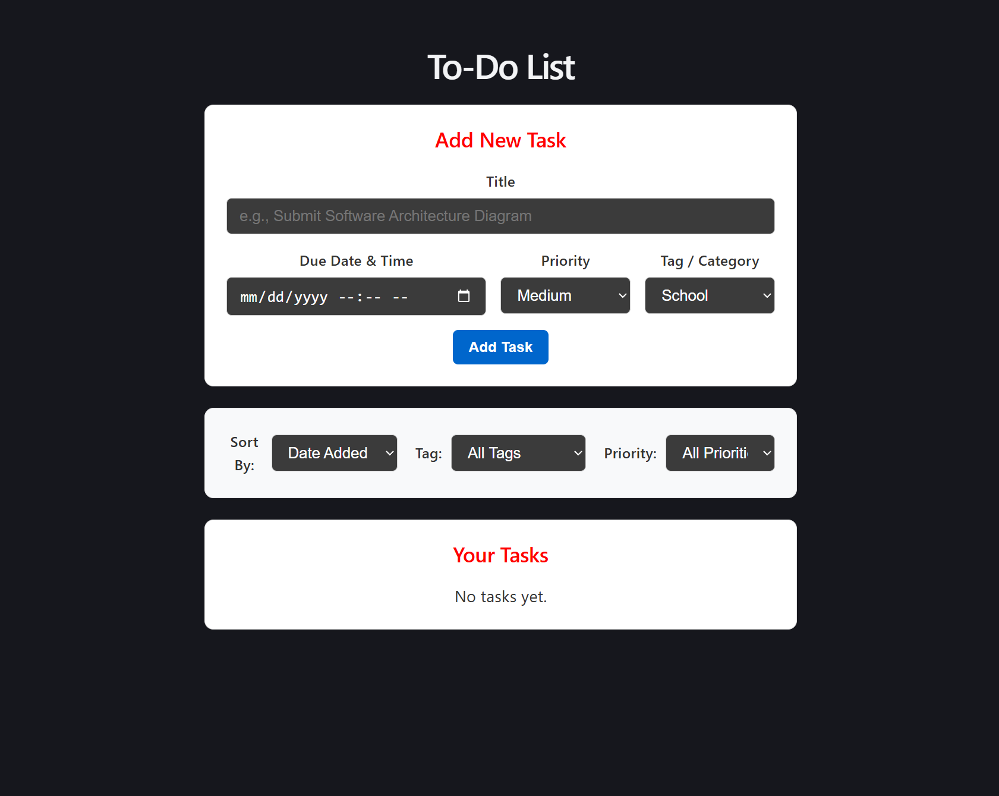

# CMSC128-Todo-List

## Authors

- Lunele Iven Moscoso
- John Dave Valentin

## Tech Stack
| Layer | Language |
| --- | --- |
| Frontend | React |
| Backend | Node.js & Express.js |
| Database | Firebase |

FERN was the chosen tech stack by us because the knowledge we will gain in building a Todo list here will serve as the foundation in building our Inventory Management System as it is the most similar tech stack to the one we will use. While quite complicated for a simple Todo list app, the knowledge to be gained in using this tech stack will be massive for us in the future.

## Requirements

- Git
- npm
- Node.js (20.x+)

## Installation & Initialization

1. Clone the repo
```bash
git clone https://github.com/Yomaruichi/cmsc128-Lab1_CRUD_ValentinMoscoso.git
cd cmsc128-Lab1_CRUD_ValentinMoscoso
```

2. Set up the client
```bash
cd client
npm install
```

3. Add Firebase configs
Create a **.env.local** file inside **client/** and insert your Firebase keys
```bash
VITE_FIREBASE_API_KEY=
VITE_FIREBASE_AUTH_DOMAIN=
VITE_FIREBASE_PROJECT_ID=
VITE_FIREBASE_STORAGE_BUCKET=
VITE_FIREBASE_MESSAGING_SENDER_ID=
VITE_FIREBASE_APP_ID=
VITE_FIREBASE_MEASUREMENT_ID=
```

4. Run the client
If you're in the root folder
```bash
cd client
npm run dev
```
else
```bash
npm run dev
```
default address: http://localhost:5173/

5. Set up the server
```bash
cd ../server
npm install
```

6. Run the server
```bash
npm run start
```

## Data Operations

All `/api/todos` routes require the header `Authorization: Bearer <Firebase ID token>`. Todos are stored in Firestore at `users/{uid}/todos/{todoId}`.

| Method | Route | Payload | Function | Description |
| --- | --- | --- | --- | --- |
| GET | /api/todos | none | getTodos | List all todos of the logged-in user |
| GET | /api/todos/:id | none | getTodo | Get one todo |
| POST | /api/todos | `{ title, description, dueDate }` | createTodo | Create a todo (`completed: false`, `createdAt` set by server) |
| PUT | /api/todos/:id | `{ title?, description?, dueDate?, completed? }` | updateTodo | Update fields of a todo |
| DELETE | /api/todos/:id | none | deleteTodo | Delete a todo |

## Authentication Operations

| Action | Firebase call | Input | Result |
| --- | --- | --- | --- |
| Sign up | createUserWithEmailAndPassword | email, password, name | Creates account, sets display name, sends verification email |
| Log in | signInWithEmailAndPassword | email, password | Starts session, issues ID token |
| Log out | signOut | none | Ends session |
| Forgot password | sendPasswordResetEmail | email | Sends reset link |
| Session check | onAuthStateChanged | none | Restores logged-in user on page load |

## Session and Password-Recovery Mechanism

### Session Mechanism

Implemented using Firebase Authentication combined with React Context (`authContext.jsx`)

* **Session Lifecycle & Persistence:** 

  * When a user logs in (`signInWithEmailAndPassword`) or signs up (`createUserWithEmailAndPassword`), Firebase establishes an active session and issues a secure ID token
  * The app listens to authentication state changes globally using Firebase's `onAuthStateChanged` observer inside the `AuthProvider` component
  * On page reloads or initial load, `onAuthStateChanged` automatically restores the logged-in user state, eliminating the need for manual token management in local storage
* **Protected Routes & UI Flow:** 

  * The root component (`App.jsx`) checks the `user` state from the authentication context 
  * If no user is authenticated (`!user`), the app renders the `<Login/>` component and blocks access to the to-do dashboard[cite: 1, 3]. 
  * Once authenticated, the user’s email is displayed in the header alongside a **Log Out** button which triggers Firebase's `signOut` method, clearing the session state and resetting local task data

* **API Request Authorization:** For backend operations, client requests to protected endpoints include the Firebase ID token in the header (`Authorization: Bearer <Firebase ID token>`) to ensure secure, user-scoped data access in Firestore (`users/{uid}/todos/{todoId}`)

### Password-Recovery Mechanism

* Powered by Firebase Authentication's built-in `sendPasswordResetEmail` function, managed via the `Login` component UI state (`mode === 'reset'`)

* **User Workflow:**
  1. From the sign-in screen, the user clicks the "Forgot password?" link, which switches the form view to the password recovery mode (`mode` set to `'reset'`)
  2. The user enters their registered email address and submits the form (`handleSubmit`)
  3. The app invokes the `resetPassword(email)` function mapped from `authContext.jsx`, triggering Firebase to send an official password-reset link to the user's email address
* **Security & User Privacy Handling:** 
  * To prevent user enumeration attacks (malicious actors checking if an email exists in the database), the application handles the response securely: whether or not the email is registered, the UI safely displays a neutral confirmation message: "If that email is registered, a reset link has been sent."
  * Once completed, users can click a "Back to Sign In" link to return to the login interface

## App Screenshots

